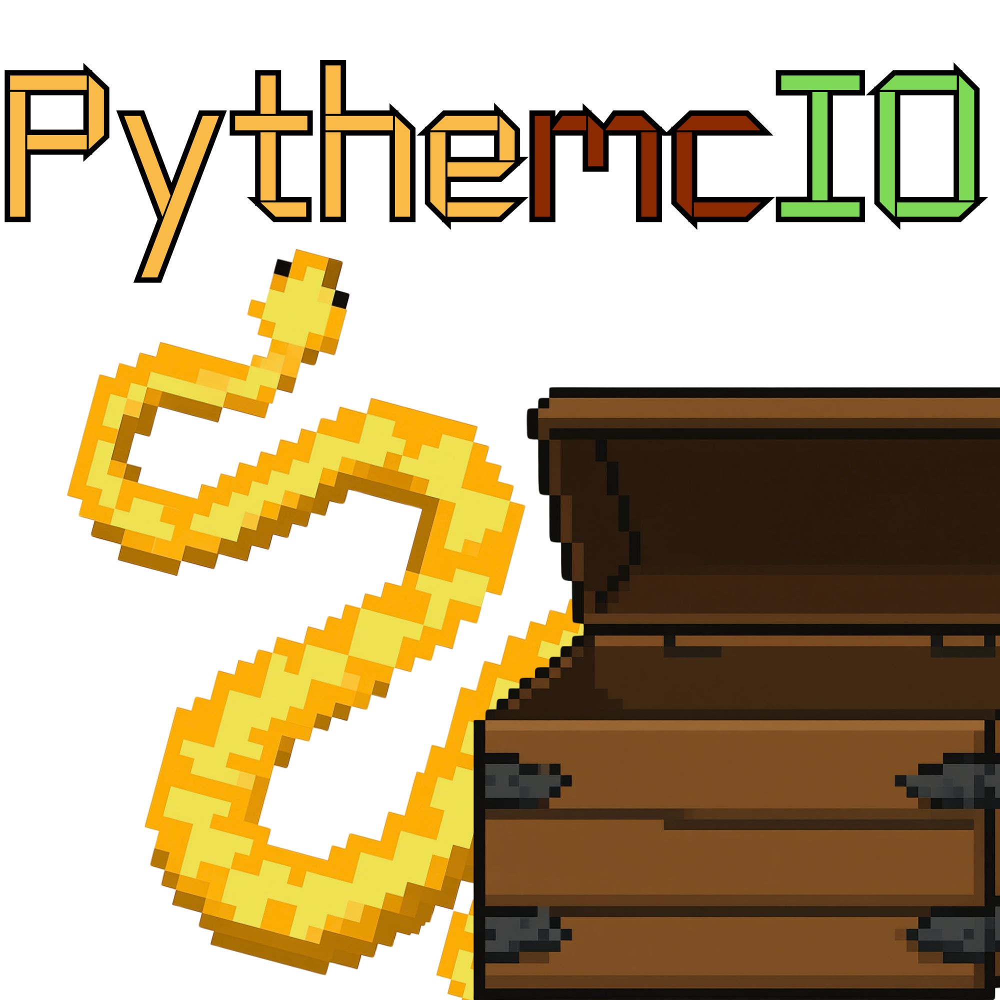
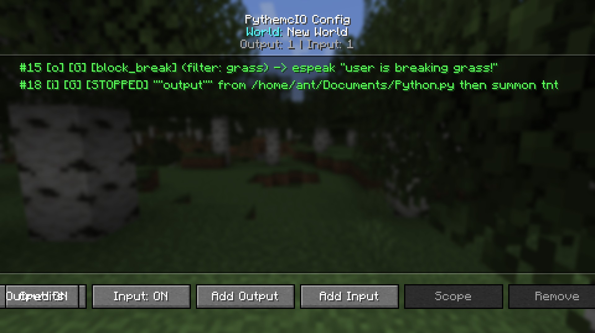

# PythemcIO

A Fabric mod that links Minecraft Java 1.21.4 events to OS commands, and OS scripts to in-game actions.

**Version:** 0.95 | **Loader:** Fabric | **Minecraft:** 1.21.4 | **Java:** 21

## Screenshots



| Output trigger setup | Input trigger setup |
|----------------------|---------------------|
|  |  |

---

## What it does

PythemcIO has two directions:

- **Output (`-output`)** — In-game events trigger commands on your OS
- **Input (`-input`)** — Scripts on your OS trigger actions in-game

### Examples

```
# When you enter the nether, run a Python script
/pythemcio add -output dimension_change filter nether python3 /path/to/nether_lights.py

# When you break diamonds, send a Discord notification
/pythemcio add -output block_break filter diamond_ore notify-send "Diamonds!"

# A Python script outputs "rain" → player chats "It's raining!"
/pythemcio add -input "rain" from /path/to/weather.py then chat "It's raining!"

# Only fire if you've been on fire for 5+ seconds
/pythemcio add -output on_fire then notify-send "Burning!"
/pythemcio duration 1 5
```

## Commands

| Command | Description |
|---------|-------------|
| `/pythemcio add -output <event> <command>` | Add a game → OS trigger |
| `/pythemcio add -output <event> filter <arg> <command>` | Add with filter |
| `/pythemcio add -input "output" from <script> then <action>` | Add an OS → game trigger |
| `/pythemcio add -output global <event> <command>` | Add a global scope trigger |
| `/pythemcio remove <id>` | Remove a trigger |
| `/pythemcio list` | List all triggers |
| `/pythemcio clear` | Remove all triggers |
| `/pythemcio scope <id> global\|local` | Change trigger scope |
| `/pythemcio duration <id> <seconds>` | Set minimum active time |
| `/pythemcio enable [-input\|-output]` | Enable triggers/scripts |
| `/pythemcio disable [-input\|-output]` | Disable triggers/scripts |
| `/pythemcio credits` | Show credits |
| `/pythemcio help` | Show help |

## Variable substitution

Use these in `-output` commands:

| Variable | Value |
|----------|-------|
| `$CONTEXT` | Event context (item/block/entity name, message, etc.) |
| `$EVENT` | Event name |
| `$ITEM` | Alias for `$CONTEXT` |
| `$BLOCK` | Alias for `$CONTEXT` |
| `$ENTITY` | Alias for `$CONTEXT` |

## Events (34 total)

### Filterable (17)

| Event | Context | Example filter |
|-------|---------|---------------|
| `block_break` | Block name | `filter minecraft:diamond_ore` |
| `block_place` | Block name | `filter minecraft:chest` |
| `player_attack` | Entity type | `filter minecraft:creeper` |
| `chat_message` | Message text | `filter hello` |
| `using_item` | Item name | `filter minecraft:bow` |
| `item_pickup` | Item name | `filter minecraft:diamond` |
| `item_drop` | Item name | `filter minecraft:torch` |
| `dimension_change` | `nether`, `end`, `overworld` | `filter nether` |
| `death` | Entity type or damage cause | `filter minecraft:creeper` |
| `time_change` | `day` or `night` | `filter night` |
| `health_change` | Current HP | `filter 10` |
| `velocity` | Speed value | `filter 0.50` |
| `jump` | Y position | `filter 64` |
| `coordinates` | `x,y,z` | `filter 100,64,200` |
| `item_consume` | Item name | `filter minecraft:golden_apple` |
| `block_interact` | Block name | `filter minecraft:chest` |
| `entity_interact` | Entity type | `filter minecraft:villager` |

### Non-filterable (17)

`player_join`, `player_leave`, `food_change`, `armor_change`, `xp_change`, `respawn`, `sleep`, `wake_up`, `on_fire`, `in_water`, `sprint`, `elytra`, `sneak`, `redstone_signal`, `potion_effect`, `totem`, `fly`

## Duration system

Continuous events (`on_fire`, `in_water`, `sprint`, `sneak`, `elytra`, `using_item`, `fly`) track how long they've been active. Use `/pythemcio duration <id> <seconds>` to set a minimum time before a trigger fires.

```
/pythemcio add -output on_fire then notify-send "Burning!"
/pythecio duration 1 10   # Only fires after 10 seconds of being on fire
```

## Scope

- **Local** (default) — Trigger exists only in the current world
- **Global** — Trigger exists in all worlds, can be enabled/disabled per-world

## Security

The mod blocks dangerous commands:
- Destructive: `rm`, `dd`, `format`, `mkfs`
- Permission: `sudo`, `chmod`, `chown`
- Process: `kill`, `shutdown`, `reboot`
- Network: `curl`, `wget`
- Shell: `powershell`, `pwsh`

All command text is stripped of non-alphanumeric characters before validation, preventing bypasses like `sh -c "sudo rm"`.

## GUI

Press Escape in-game and click the **PythemcIO** button to open the config screen. From there you can:
- Browse all triggers
- Add new output/input triggers
- Toggle scope (global/local)
- Enable/disable output and input
- Remove triggers
- View credits

## Installation

1. Install [Fabric Loader](https://fabricmc.net/) for Minecraft 1.21.4
2. Install [Fabric API](https://modrinth.com/mod/fabric-api)
3. Download `PythemcIO` from [Releases](https://github.com/AntacidDT/PythemcIO/releases)
4. Drop the `.jar` into your `mods/` folder

## Building from source

```bash
git clone https://github.com/AntacidDT/PythemcIO.git
cd PythemcIO
./gradlew build
```

The built jar will be in `build/libs/`.

## Credits

- **Author:** [AntacidDT](https://github.com/AntacidDT)
- **License:** [Apache-2.0](LICENSE)
- **Released:** 24.07.2026
